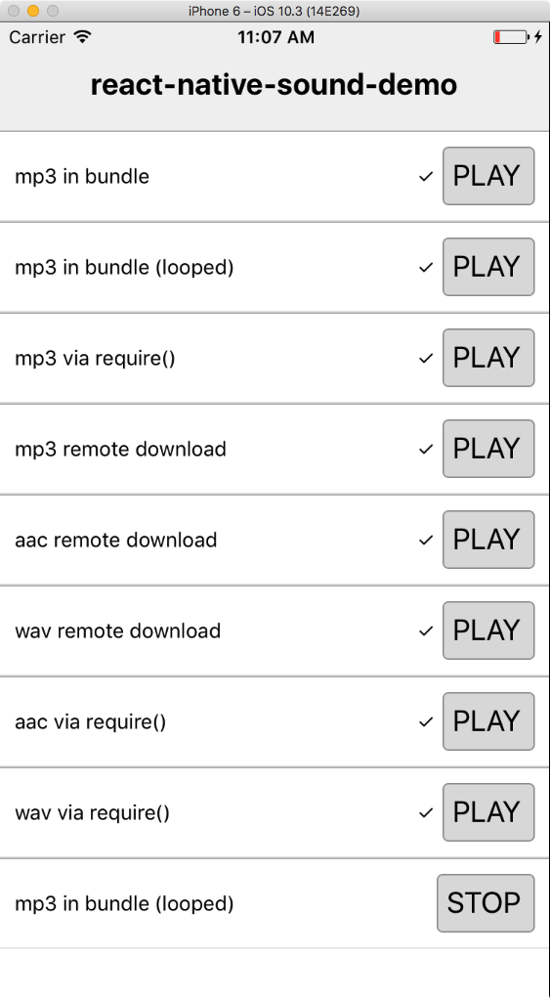

# react-native-sound-demo

[react-native-sound](https://github.com/zmxv/react-native-sound) demo project for iOS and Android.  

There are a series of basic test for different audio formats and locations. Each will have 'tick' next to it if
the test succeeds. 

We should make sure all the tests are tried out before releasing a new version of the library to npm.

> Note: This uses the HEAD (latest commit) version of `react-native-sound`. 
> To test a specific version, update the package.json file, run `npm uninstall react-native-sound; npm i react-native-sound` then rebuild the Android and iOS apps.
